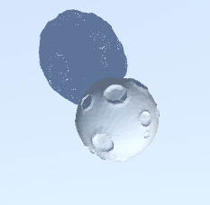

# DroneControler

TestProjectForHot Siberians Test

### Оглавление
1. [Вступление](#доп)
2. [Архитектура](#Архитектура)
3. [Описание](#правила)
4. [Конфиг](#конфиг)
____
## Вступление  
- Нет использованных ассетов.
- Разработка игры заняла 1 вечер (~ 4 часа).
- Игра откомпилирована на Android. (Android.sdk)
____
## Архитектура  

____
## Описание  
### Игрок

- Выполняет команды, при клике отнимается здоровье.
- Когда здоровье доходит до 0 - прекращает выполнение команд и не реагирует на новые.
### База

- При команде `goBase`, игрок летит на базу. При достижении базы начинает айдлить.
### ЧекПоинт

- При команде `Move`, игрок летит на случайный чекпоинт. При достижении чекпоинта выбирает следующий и летит к нему.
- Если указать большое число Чекпоинтов и они не смогут поместиться в игровом поле на выбранной `Минимальной Дистанции`, то спустя 1000 итераций создания Рандомных координат, создание Чекпоинтов прекратиться.
### Панель с командами

Обычные кнопки, которые вызывают функцию MenuInput с параметрами:

____
## Конфиг:
- Здоровье, скорость и получение урона у Игрока - в скрипте Drone. Можно настраивать на объекте Player в окне инспектора.

- Количество ЧекПоинтов и Минимальная дистанция между ними - в скрипте Map. Можно настраивать на объекте Scripts в окне инспектора.

____
## Тех Документация
Подробные объяснения на Тех интервью.

____
